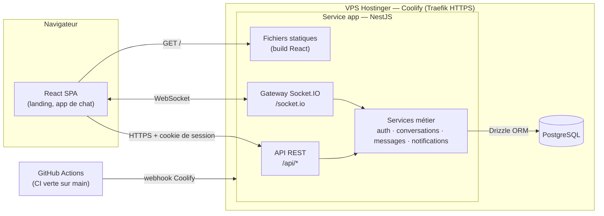

# 02 — Cahier des charges v0

**Produit :** BozoChat — messagerie temps réel pour équipes (SaaS B2B)
**Équipe :** NOM Prénom (lead technique), NOM Prénom (référent QA / déploiement) — _rôles tournants_
**Version :** v0 — semaine 1 · à valider par le professeur

---

## 1. Contexte et problème

Les PME et équipes projet dispersent leurs échanges entre e-mails, WhatsApp et outils grand public. Résultat : informations perdues, pas de séparation pro/perso, aucun contrôle de l'entreprise sur qui voit quoi.

**BozoChat** offre un espace de discussion par entreprise (_workspace_), avec des conversations privées et de groupe en temps réel, des notifications fiables et une gestion simple des accès.

**Cible :** équipes de 3 à 50 personnes (agences, startups, associations, équipes internes).

## 2. Acteurs, rôles et permissions

| Acteur                    | Description                                                                                                                                         |
| ------------------------- | --------------------------------------------------------------------------------------------------------------------------------------------------- |
| **Visiteur**              | Non connecté. Consulte la landing page et le pricing, crée un compte.                                                                               |
| **Membre**                | Utilisateur appartenant à un workspace. Discute dans les conversations dont il est membre.                                                          |
| **Admin de workspace**    | Membre avec droits de gestion : invite / retire des membres, gère le plan (Free/Pro). Le créateur du workspace est **Owner** (admin non retirable). |
| **Admin de conversation** | Créateur d'une conversation de groupe : renomme, ajoute / retire des participants.                                                                  |
| **Système**               | Envoie les notifications temps réel, applique les quotas du plan.                                                                                   |

### Matrice des permissions

| Action                                                    | Visiteur |     Membre     |  Admin conv.   | Admin workspace |
| --------------------------------------------------------- | :------: | :------------: | :------------: | :-------------: |
| Voir landing / pricing                                    |    ✅    |       ✅       |       ✅       |       ✅        |
| Créer un compte / se connecter                            |    ✅    |       —        |       —        |        —        |
| Créer un workspace                                        |    —     |       ✅       |       ✅       |       ✅        |
| Inviter un membre dans le workspace                       |    —     |       ❌       |       ❌       |       ✅        |
| Démarrer une conversation 1:1 avec un membre du workspace |    —     |       ✅       |       ✅       |       ✅        |
| Créer une conversation de groupe                          |    —     |       ✅       |       ✅       |       ✅        |
| Lire / écrire dans une conversation                       |    —     | si participant | si participant | si participant  |
| Ajouter / retirer des participants d'un groupe            |    —     |       ❌       |       ✅       |       ✅        |
| Modifier / supprimer **son** message                      |    —     |       ✅       |       ✅       |       ✅        |
| Supprimer le message d'un autre                           |    —     |       ❌       |       ❌       | ✅ (modération) |
| Changer de plan                                           |    —     |       ❌       |       ❌       |   ✅ (Owner)    |

> **Règle d'or :** un utilisateur ne reçoit **jamais** (ni via l'API, ni via WebSocket) les messages d'une conversation dont il n'est pas participant. Vérifié côté serveur à chaque requête et à chaque abonnement à une _room_.

## 3. Exigences fonctionnelles

### 3.1 MVP obligatoire

| ID  | Exigence                                                                                 | Priorité |
| --- | ---------------------------------------------------------------------------------------- | -------- |
| F1  | Inscription, connexion, déconnexion (e-mail + mot de passe)                              | Must     |
| F2  | Création d'un workspace et invitation de membres (lien ou e-mail)                        | Must     |
| F3  | Conversations **privées 1:1** entre membres d'un même workspace                          | Must     |
| F4  | Conversations **de groupe** (nom, participants)                                          | Must     |
| F5  | Envoi / réception de messages **en temps réel** sans rechargement                        | Must     |
| F6  | Historique paginé (chargement des anciens messages au scroll)                            | Must     |
| F7  | **Notifications in-app** temps réel : toast, badge, compteur de non-lus par conversation | Must     |
| F8  | Marquage « lu » à l'ouverture d'une conversation                                         | Must     |
| F9  | Contrôle d'accès : seuls les participants lisent / écrivent                              | Must     |
| F10 | Interface **responsive** (mobile, tablette, desktop)                                     | Must     |
| F11 | Landing page publique + page pricing (Free / Pro) + CTA « Essayer maintenant »           | Must     |

### 3.2 Confort (si le temps le permet)

| ID  | Exigence                                                             |
| --- | -------------------------------------------------------------------- |
| C1  | Indicateur « en train d'écrire… »                                    |
| C2  | Statut en ligne / hors ligne                                         |
| C3  | Édition / suppression de message (soft delete, « message supprimé ») |
| C4  | Réactions emoji                                                      |

### 3.3 Fonctionnalité optionnelle retenue _(une seule, bien intégrée)_

À choisir en S4 — deux candidates :

- **Recherche plein texte** dans les messages accessibles (PostgreSQL `tsvector` + index GIN), avec filtres par conversation / auteur / date.
- **Partage de fichiers** avec aperçu d'images et quotas de stockage liés au plan.

### 3.4 User stories principales

- _En tant que_ visiteur, _je veux_ comprendre en 10 secondes ce que fait BozoChat et combien ça coûte, _afin de_ décider d'essayer.
- _En tant que_ membre, _je veux_ envoyer un message privé à un collègue et le voir arriver instantanément, _afin de_ ne pas utiliser d'e-mail pour une question rapide.
- _En tant que_ membre, _je veux_ voir un badge sur les conversations non lues, _afin de_ ne rien rater en revenant de réunion.
- _En tant que_ admin, _je veux_ inviter et retirer des membres, _afin de_ contrôler qui accède aux échanges de l'entreprise.
- _En tant que_ membre retiré d'un groupe, _je ne dois plus_ recevoir ni pouvoir lire les nouveaux messages de ce groupe.

## 4. Pricing et quotas

|                                      | **Free**            | **Pro** — 6 €/utilisateur/mois |
| ------------------------------------ | ------------------- | ------------------------------ |
| Membres par workspace                | 10                  | Illimité                       |
| Conversations de groupe              | 5                   | Illimité                       |
| Historique consultable               | 90 jours            | Illimité                       |
| Fichiers _(si optionnelle retenue)_  | 1 Go, 10 Mo/fichier | 50 Go, 100 Mo/fichier          |
| Recherche _(si optionnelle retenue)_ | 30 derniers jours   | Tout l'historique              |
| Support                              | Communauté          | Prioritaire                    |

Les quotas sont **appliqués côté serveur** (erreur claire : « Votre plan Free est limité à 10 membres — passez à Pro »). Le paiement réel n'est pas implémenté : le passage à Pro est simulé.

## 5. Exigences non fonctionnelles

| ID   | Catégorie     | Exigence                                                                            | Mesure / moyen                                                                     |
| ---- | ------------- | ----------------------------------------------------------------------------------- | ---------------------------------------------------------------------------------- |
| NF1  | Performance   | Un message envoyé apparaît chez les destinataires en < 500 ms                       | Socket.IO, mesure manuelle en prod                                                 |
| NF2  | Performance   | Chargement d'une conversation (50 derniers messages) < 300 ms côté API              | Pagination par curseur + index `(conversationId, createdAt)`                       |
| NF3  | Disponibilité | Application accessible 24/7, pas de mise en veille                                  | VPS Hostinger + Coolify (voir doc 01)                                              |
| NF4  | Fiabilité     | Reconnexion automatique après coupure réseau, sans perte de messages                | Reconnexion Socket.IO + resynchronisation via API                                  |
| NF5  | Sécurité      | Mots de passe hachés (argon2), sessions en cookie `httpOnly`, `Secure`, `SameSite`  | —                                                                                  |
| NF6  | Sécurité      | Validation de **toutes** les entrées (schémas Zod), échappement à l'affichage (XSS) | Zod partagé front/back, React échappe par défaut, pas de `dangerouslySetInnerHTML` |
| NF7  | Sécurité      | CORS limité à l'origine de production, en-têtes de sécurité                         | `helmet`, same-origin                                                              |
| NF8  | Sécurité      | Limitation de débit sur login et envoi de messages                                  | `@nestjs/throttler`                                                                |
| NF9  | Sécurité      | Aucun secret dans le repo                                                           | Variables d'environnement Coolify + secrets GitHub, `.env.example`                 |
| NF10 | Intégrité     | Clés étrangères, cascades, suppression logique des messages                         | Contraintes PostgreSQL (FK, CHECK, UNIQUE) via Drizzle                             |
| NF11 | UX erreurs    | Messages d'erreur clairs dans chaque formulaire, jamais de stack trace              | Filtre d'exception global NestJS + composants d'erreur front                       |
| NF12 | Responsive    | Utilisable de 360 px à 1920 px                                                      | Tailwind, tests manuels                                                            |
| NF13 | Accessibilité | Navigation clavier, contrastes AA, labels de formulaire                             | Revue manuelle + Lighthouse                                                        |
| NF14 | Qualité       | Lint + formatage obligatoires, CI bloquante sur PR                                  | ESLint, Prettier, GitHub Actions                                                   |
| NF15 | Tests         | Tests automatisés sur l'envoi / lecture de messages et les droits d'accès           | Vitest + Supertest                                                                 |
| NF16 | Observabilité | Logs structurés côté serveur, consultables dans Coolify                             | Logger NestJS                                                                      |

## 6. Stack technique (résumé)

| Couche          | Choix                                                                                   |
| --------------- | --------------------------------------------------------------------------------------- |
| Langage         | TypeScript (front + back)                                                               |
| Backend         | NestJS (Node.js 22)                                                                     |
| Temps réel      | Socket.IO (gateway NestJS)                                                              |
| Base de données | PostgreSQL + Drizzle ORM (migrations SQL versionnées + seed)                            |
| Frontend        | React + Vite + Tailwind CSS + React Router + TanStack Query                             |
| Validation      | Zod (package partagé)                                                                   |
| Tests           | Vitest, Supertest                                                                       |
| CI/CD           | GitHub Actions (lint/build/test sur PR) + webhook Coolify (déploiement auto sur `main`) |
| Hébergement     | VPS Hostinger + Coolify (conteneur app + PostgreSQL)                                    |

Justification détaillée : voir [01-hebergement.md](./01-hebergement.md) et le rapport final.

## 7. Architecture (vue d'ensemble)

**Flux d'un message :**

1. Le client émet `message:send` (ou `POST /api/conversations/:id/messages`).
2. Le serveur vérifie la session **et** l'appartenance à la conversation, valide le contenu (Zod), applique les quotas.
3. Le message est enregistré en base.
4. Le serveur diffuse `message:new` dans la room `conversation:<id>` et `notification:new` dans la room personnelle `user:<id>` de chaque participant (pour badges / toasts).

## 8. Risques identifiés

| Risque                                                  | Impact         | Parade                                                                      |
| ------------------------------------------------------- | -------------- | --------------------------------------------------------------------------- |
| Fuite de messages vers un non-participant via WebSocket | Critique       | Vérification d'appartenance à chaque `join`, tests automatisés dédiés       |
| Démo en prod qui plante                                 | Élevé          | Données de seed réalistes, répétition de la démo, `main` protégée par la CI |
| Déséquilibre des contributions Git                      | Moyen (évalué) | Planning de PR par personne ci-dessous                                      |
| Panne ou saturation du VPS                              | Faible         | Sauvegardes PostgreSQL planifiées, monitoring Coolify, VPS 4 Go RAM         |

## 9. Planning des PR (1 PR significative / personne / semaine)

| Sem. | Personne A                                        | Personne B                                       |
| ---- | ------------------------------------------------- | ------------------------------------------------ |
| S1   | CDC, choix hébergement                            | Setup monorepo, lint, Prettier                   |
| S2   | Auth (inscription / connexion / session)          | CI GitHub Actions + premier déploiement Coolify  |
| S3   | Modèle conversations / messages + API REST        | Gateway Socket.IO + écran de chat 1:1            |
| S4   | Groupes, memberships, permissions + tests d'accès | UI groupes, gestion des participants, responsive |
| S5   | Notifications temps réel (non-lus, toast, badge)  | Stabilisation, gestion des erreurs, reconnexion  |
| S6   | Fonctionnalité optionnelle (back)                 | Landing page + pricing + quotas                  |
| S7   | Fonctionnalité optionnelle (front) + tests        | Finitions UI, rapport, captures                  |
