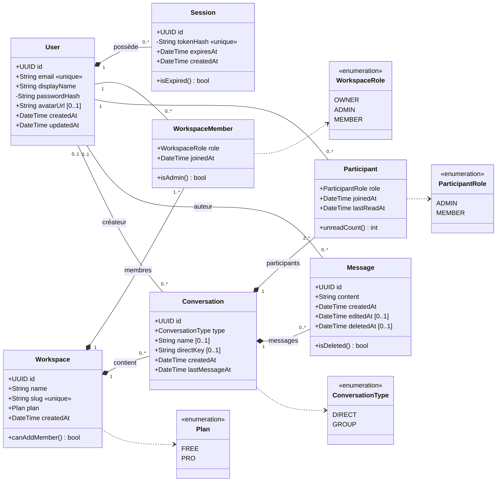

# 03 — Modèle de données & diagramme de classes UML

Source de vérité : [`apps/api/src/db/schema.ts`](../apps/api/src/db/schema.ts) (Drizzle ORM) — migrations SQL versionnées dans [`apps/api/drizzle/`](../apps/api/drizzle/).
Ce diagramme doit rester **cohérent avec la base implémentée** (critère AA 2.1) : toute modification du schéma Drizzle doit être reportée ici dans la même PR.

## 1. Diagramme de classes

> `WorkspaceMember` et `Participant` sont des **classes d'association** (relations N–N porteuses d'attributs : rôle, date d'arrivée, dernière lecture).
> Une conversation `DIRECT` a **exactement 2** participants ; une `GROUP` en a 2 ou plus.

## 2. Choix de modélisation (à reprendre dans le rapport)

| Choix                                                                | Justification                                                                                                                                                  |
| -------------------------------------------------------------------- | -------------------------------------------------------------------------------------------------------------------------------------------------------------- |
| **UUID** comme clés primaires                                        | Identifiants non devinables dans les URL (`/c/3f2a…`) → pas d'énumération de conversations.                                                                    |
| **Une seule table `Conversation`** avec un `type` DIRECT/GROUP       | Même logique d'envoi, de lecture, de notifications et de droits pour les deux cas. Moins de code dupliqué.                                                     |
| **`directKey`** = ids des 2 utilisateurs triés, unique par workspace | Empêche de créer deux conversations 1:1 entre les mêmes personnes (contrainte garantie par la base, pas seulement par le code).                                |
| **Non-lus via `Participant.lastReadAt`**                             | Pas de table « message lu » par utilisateur × message (qui exploserait en volume). `unread = COUNT(messages WHERE createdAt > lastReadAt AND authorId ≠ moi)`. |
| **`Conversation.lastMessageAt`** dénormalisé                         | Tri de la liste des conversations sans jointure coûteuse sur les messages.                                                                                     |
| **Soft delete** des messages (`deletedAt`)                           | L'historique reste cohérent (« message supprimé ») et permet la modération.                                                                                    |
| **Sessions en base** (token haché) plutôt que JWT                    | Déconnexion et révocation immédiates (ex. membre retiré), le token brut n'est jamais stocké.                                                                   |

## 3. Intégrité référentielle

| Relation                           | `onDelete` | Raison                                                                                                                |
| ---------------------------------- | ---------- | --------------------------------------------------------------------------------------------------------------------- |
| Session → User                     | `Cascade`  | Un compte supprimé n'a plus de sessions.                                                                              |
| WorkspaceMember → Workspace / User | `Cascade`  | —                                                                                                                     |
| Conversation → Workspace           | `Cascade`  | Supprimer un workspace supprime ses conversations.                                                                    |
| Participant → Conversation / User  | `Cascade`  | —                                                                                                                     |
| Message → Conversation             | `Cascade`  | —                                                                                                                     |
| Message → User (auteur)            | `SetNull`  | Si un compte est supprimé, ses messages restent (« Utilisateur supprimé ») : l'historique des autres n'est pas cassé. |
| Conversation → User (créateur)     | `SetNull`  | Idem.                                                                                                                 |

Contraintes supplémentaires : `email` unique, `slug` unique, `(workspaceId, directKey)` unique, longueurs max (`varchar`), `CHECK` contenu de message non vide, clés composites sur les tables d'association (un utilisateur ne peut pas être deux fois membre).

## 4. Index

| Index                                                    | Requête servie                                                 |
| -------------------------------------------------------- | -------------------------------------------------------------- |
| `Message(conversationId, createdAt DESC)`                | Chargement paginé de l'historique (requête la plus fréquente). |
| `Conversation(workspaceId, lastMessageAt DESC)`          | Liste des conversations triées par activité.                   |
| `Participant(userId)`                                    | « Mes conversations » + vérification d'accès.                  |
| `WorkspaceMember(userId)`                                | « Mes workspaces ».                                            |
| _(optionnelle)_ GIN sur `to_tsvector('french', content)` | Recherche plein texte.                                         |

## 5. Seed

`pnpm --filter api db:seed` crée un jeu de données réaliste : un workspace « Agence Orion » (plan PRO), 6 utilisateurs, des conversations 1:1 et de groupe (#général, #design, #dev) avec un historique de messages. Mot de passe de tous les comptes de démo : `demo1234`.
